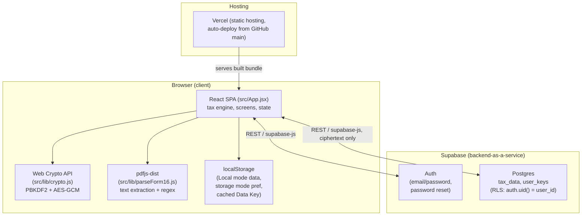
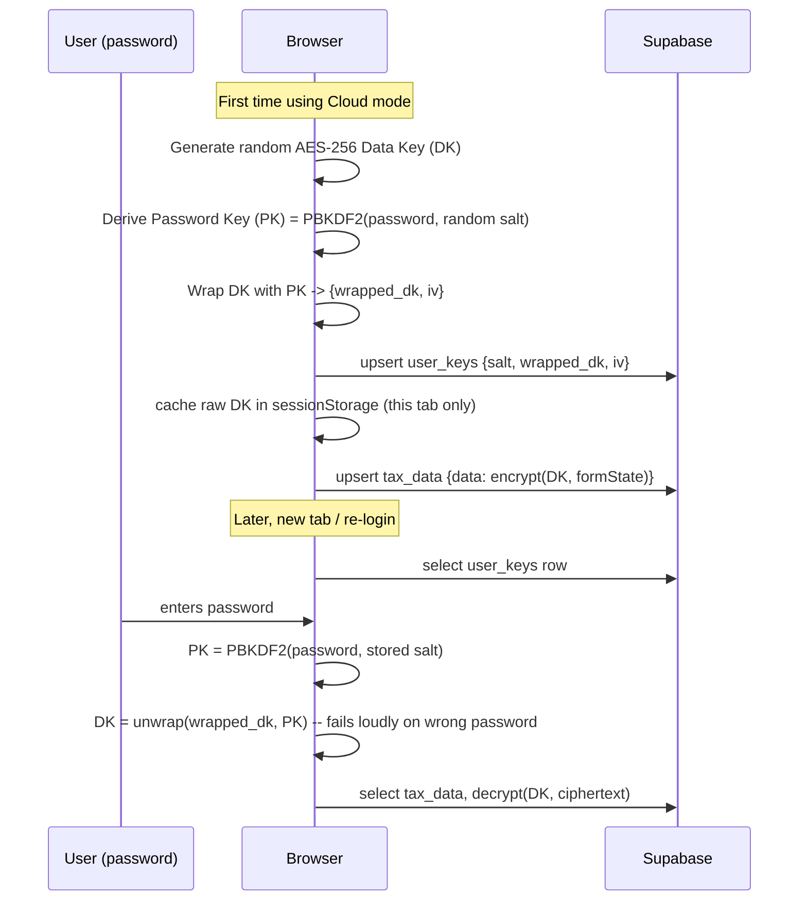
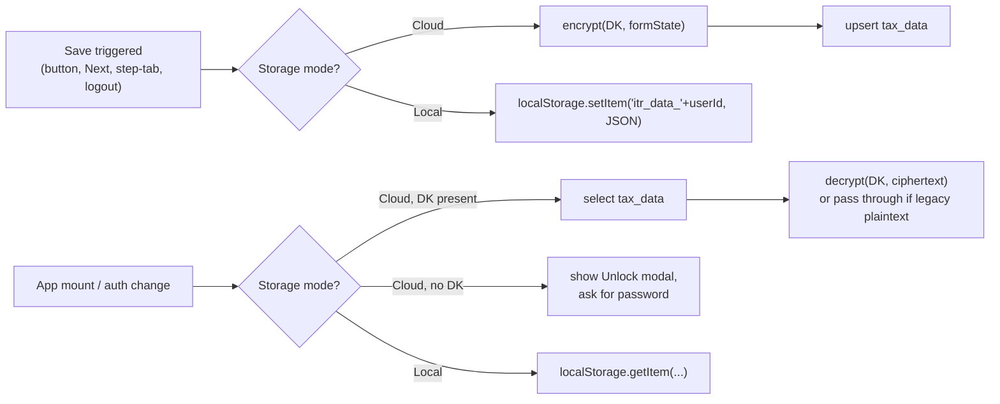
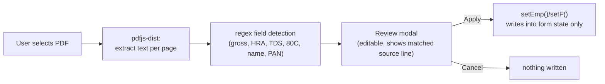

# High-Level Design — TaxFiler India

## 1. Overview

TaxFiler India is a client-heavy single-page application: nearly all business logic (tax computation, PDF parsing, encryption) runs in the browser. The backend (Supabase) is intentionally thin — it provides authentication and two narrow data stores, with no server-side business logic of its own. This keeps the system simple but means the client is the trust boundary for everything except access control.

**Goals:** compute Old vs New regime tax accurately for Resident Individuals, let users save their data either privately (local-only) or synced (cloud, encrypted), and make data entry less tedious via Form 16 auto-fill.

**Non-goals:** NRIs/HUFs/companies, server-side tax computation or validation, e-filing integration, OCR for scanned documents, multi-currency.

## 2. System Architecture



## 3. Components

| Component | Responsibility | Location |
|---|---|---|
| Tax engine | Old/New regime computation, slabs, deductions, ITR form logic | `compute()` / `calcRegime()` in `src/App.jsx` |
| Screens & state | Multi-step wizard UI, all React state | `src/App.jsx` (single file) |
| Crypto layer | Key derivation (PBKDF2), Data Key generation/wrap/unwrap, AES-GCM encrypt/decrypt | `src/lib/crypto.js` |
| Form 16 parser | PDF text extraction (pdfjs-dist) + regex field detection | `src/lib/parseForm16.js` |
| Supabase client | Auth + DB access | `src/lib/supabase.js` |
| Auth backend | Email/password accounts, session tokens, password reset emails | Supabase Auth |
| Data store | Two RLS-protected tables | Supabase Postgres |
| Hosting | Static build serving, env vars, auto-deploy | Vercel |

## 4. Data Model

```mermaid
erDiagram
    auth_users ||--o| tax_data : "user_id (1:1, optional)"
    auth_users ||--o| user_keys : "user_id (1:1, optional)"

    auth_users {
        uuid id PK
        text email
        text encrypted_password
        timestamptz email_confirmed_at
    }
    tax_data {
        uuid user_id PK_FK
        jsonb data "either {iv, ct} ciphertext or legacy plaintext"
        timestamptz updated_at
    }
    user_keys {
        uuid user_id PK_FK
        text salt
        text wrapped_dk
        text iv
    }
```

- `auth_users` is managed entirely by Supabase Auth (not application-created).
- `tax_data.data` holds the *entire* calculator form state as one JSON blob — no relational decomposition. In Cloud mode it's AES-GCM ciphertext (`{iv, ct}`); a row predating the encryption feature may still be readable plaintext (legacy fallback path in the load effect).
- `user_keys` only exists for users who have ever used Cloud mode. It holds the wrapped (encrypted) Data Key, never the Data Key itself in the clear.
- **Local mode** never writes to either table — it uses `localStorage["itr_data_"+userId]` in the user's own browser only.

## 5. Key Flows

### 5.1 Cloud-mode encryption (wrapped Data Key scheme)



Why a wrapped key instead of encrypting data directly with a password-derived key: changing the password only requires re-wrapping the small DK (fast, one row), not re-encrypting all historical `tax_data`. See §5.3.

### 5.2 Save / Load by storage mode



### 5.3 Password change / reset (Data Key continuity)

- **Change Password** (logged in, already unlocked): re-derive a new PK from the new password + fresh salt, re-wrap the *already-unlocked* DK in memory, upsert `user_keys`. DK itself never changes — all existing `tax_data` ciphertext stays valid.
- **Forgot Password** (email reset link, `PASSWORD_RECOVERY` auth event): if a cached DK still exists in this browser's `sessionStorage`, same re-wrap as above (no data loss). If not (genuinely different/cleared browser), a **fresh** DK is generated and wrapped under the new password — old `tax_data` ciphertext becomes unrecoverable (no backend escrow exists by design), but new saves work immediately.

### 5.4 Form 16 upload (Salary step)



Nothing is uploaded anywhere — extraction and parsing are entirely client-side. Values are never auto-applied without the review step, since PDF layouts vary by employer/payroll vendor.

## 6. Security Model

- **Authentication:** Supabase Auth, email/password, sessions as JWTs (access + refresh token), persisted by `supabase-js` in `localStorage`.
- **Authorization:** Row Level Security on both tables — `auth.uid() = user_id` — enforced for the `anon`/`authenticated` API roles. Verified directly (not just by reading the policy) by attempting an anonymous insert and confirming Postgres rejects it with `42501`.
- **Confidentiality (Cloud mode):** AES-256-GCM, key never derivable by the server — protects against a compromised Supabase project/database/account, *not* against a compromised end-user device (a Local-mode-equivalent threat that's out of scope, since the browser itself holds the plaintext while in use).
- **What the anon key does and doesn't protect:** the public anon key is safe to ship in the client bundle (by design, like any Supabase frontend) — RLS is the actual access boundary, not key secrecy. The `service_role` key must never appear in frontend code; this project doesn't use it anywhere.
- **Project owner visibility:** the Supabase project owner can see all rows via the dashboard (bypasses RLS as the Postgres superuser) — Cloud-mode ciphertext mitigates this for `tax_data` contents; account emails and metadata in `auth.users` are still visible to the owner regardless of storage mode.

## 7. Deployment Architecture

- **Hosting:** Vercel, static build (`vite build` → `dist/`), auto-deploys on push to `main`.
- **Config:** `VITE_SUPABASE_URL` / `VITE_SUPABASE_ANON_KEY` as build-time env vars (Vercel Project Settings + local `.env.local`, gitignored).
- **No server runtime** — no API routes, no SSR, no edge functions. All "backend" behavior is Supabase's hosted Auth/Postgres, called directly from the browser.

## 8. Known Limitations

- Single-file frontend (`src/App.jsx`, 1500+ lines) — works for the current scope but will need splitting if the screen count or team grows.
- No automated test suite (see `HOWTO.md` §7) — verification is manual, run-the-app based.
- Bundle size is large (~880KB main + ~1.2MB Form-16 PDF worker, lazy-loaded) due to `pdfjs-dist`; acceptable for a low-traffic personal tool, would need code-splitting at scale.
- No relational decomposition of tax data — the entire form state is one JSON blob per user, which is fine for single-user-owns-all-their-data access patterns but would block any cross-record querying/reporting feature.
- Form 16 field extraction is best-effort regex, not a general PDF-form parser; degrades gracefully (blank fields) rather than crashing, but accuracy depends on each employer's PDF layout.

## 9. Related Docs

- [README.md](README.md) — feature overview, tech stack
- [HOWTO.md](HOWTO.md) — setup, Supabase SQL, deployment steps
- [ITR_RULES_COVERED.md](ITR_RULES_COVERED.md) — exact tax rules/slabs/caps implemented
